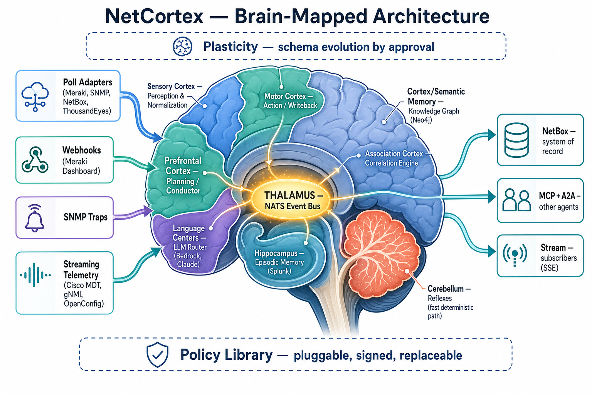
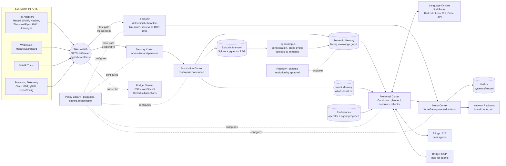

# NetCortex — Brain-Mapped Architecture

> **Status:** target architecture (post-`0.7.0`). Implementation lands in phases `0.8.x` → `1.0.0`.
> **Vocabulary:** brain-anatomy names are load-bearing — they define module layout and contracts.

## Vision

NetCortex is the **brain of the network**. It perceives the network through every available sense (poll, push, stream), routes those perceptions through a single nervous system, reflexively reacts to what cannot wait, and otherwise consolidates them into knowledge that supports deliberate reasoning about structure, state, and **intent**. It externalizes its long-term memory to NetBox the way humans externalize ours to writing. It is *not* Splunk (a passive log lake), nor a network graphing tool (a static picture) — it is a continuously-perceiving, learning, reasoning, acting cognitive system whose outputs are useful to humans *and* to other agents.

## Data flow

## Component map

| Brain region | Module path | Responsibility | Tech | Replaceable via |
| --- | --- | --- | --- | --- |
| **Sensory inputs** | `netcortex/sensory/{poll,webhook,trap,telemetry}/` | Receive raw signals from one modality | adapter-specific SDKs | `SensoryAdapter` Protocol |
| **Thalamus** | `netcortex/thalamus/` | Normalize → typed event → publish | NATS JetStream | `EventBus` Protocol (Redis/Kafka alternatives) |
| **Reflex** | `netcortex/reflex/` | Fast deterministic handlers | pure Python registry | typed `ReflexHandler` interface |
| **Sensory cortex** | `netcortex/sensory/cortex/` | Per-event perception (canonicalize names, types, scopes) | Policy-driven | `PerceptionPolicy` plugins |
| **Association cortex** | `netcortex/association/` | Cross-modal correlation, continuous (was `graph/correlate`) | Python + Neo4j | `Correlator` Protocol |
| **Semantic memory** | `netcortex/memory/semantic/` | Long-term knowledge graph | Neo4j | `KnowledgeGraph` Protocol |
| **Episodic memory** | `netcortex/memory/episodic/` | What happened, when, why | Splunk Core (primary); DuckDB fallback | `EpisodicStore` Protocol |
| **Intent memory** | `netcortex/memory/intent/` | What *should* be | Neo4j `:Intended` namespace + provenance | `IntentStore` Protocol |
| **Preference memory** | `netcortex/memory/preference/` | Operator + agent-proposed rules | Signed JSON in object store | `PreferenceStore` Protocol |
| **Working memory** | `netcortex/memory/working/` | Active-task scratchpad | Redis | `WorkingMemory` Protocol |
| **Hippocampus** | `netcortex/hippocampus/` | Consolidation, sleep cycles, episodic→semantic promotion | scheduled jobs | `ConsolidationStrategy` plugin |
| **Prefrontal cortex** | `netcortex/prefrontal/` | Planner / Executor / Reflector | Python + LLM via Language | `PlannerPolicy` plugin |
| **Language centers** | `netcortex/language/` | LLM router with task-tier model selection | Bedrock first; local CLI; direct API; on-prem | `LLMProvider` Protocol |
| **Motor cortex** | `netcortex/motor/` | WriteGate-protected actions | per-target writers | `Writer` Protocol per target |
| **Cerebellum** | (fast path within `reflex/`) | The fast loop itself | — | — |
| **Plasticity** | `netcortex/plasticity/` | Schema-addition proposals, operator approval | versioned schema diffs | `SchemaProposal` artifact |
| **Bridges (external)** | `netcortex/bridge/{mcp,a2a,stream}/` | Tools / Peer / Subscription | MCP server, Google A2A, SSE | `BridgeAdapter` Protocol |
| **Policy library** | `netcortex/policy/` | Pluggable decisions everywhere | signed manifest | `Policy` Protocol |

## Replaceability discipline (the rule, not a wish)

Every component talks to every other component **only** through a Protocol defined in a separate `netcortex/contracts/` namespace.

1. **No cross-module imports of internals.** `prefrontal/` may not import from `association/internals.py`. It imports from `contracts/association.py`.
2. **Every Protocol has a contract test suite** in `tests/contracts/<contract>/`. Any concrete implementation must register and pass.
3. **Configuration selects the implementation.** Switching `BedrockProvider` → `LocalCLIProvider` is a values-file change.
4. **Build-time signed manifest.** `plugins.manifest.json` lists every loadable component plus code hash. Load-time verification; mismatch = fail closed.
5. **CI lint** forbids `exec`/`eval`/`compile`/dynamic `importlib.import_module()` outside a whitelisted bootstrap.

When the answer to *"can we swap NATS for Kafka?"* or *"can we swap Splunk for OpenSearch?"* is anything other than *"change the config"*, that is a bug.

## New sensory modalities

All three become first-class equals to the existing poll adapters under `netcortex/sensory/`. The pattern is identical: receive raw → normalize → publish to thalamus → done. Everything downstream is unchanged.

### Meraki webhooks → `netcortex/sensory/webhook/meraki.py`

- HTTPS POST receiver behind ingress; `Webhook-Secret` header verified against shared secret in AWS Secrets Manager.
- Schema validation against per-event-type JSON schemas in `schemas/meraki-webhooks/` (alerts, settings changes, config changes, AP availability, etc.).
- Normalized to a `SensoryEvent(modality="meraki.webhook", target=…, payload=…, provenance=[…])`.
- Published to NATS subject `sensory.meraki.webhook.<event_type>`.
- Idempotency via Meraki's `alertId` (dedup window in Redis working memory).

### SNMP traps → `netcortex/sensory/trap/snmp.py`

- pysnmp trap receiver on UDP/162 (or via `snmptrapd` sidecar piping to a Unix socket if pysnmp's receiver isn't robust enough at scale).
- v2c community string OR v3 USM auth — both configurable per source.
- MIB-aware decoding using a configurable MIB bundle (Cisco MIBs, Meraki MIBs, RFC standard MIBs).
- Source authentication — only accept traps from devices known to semantic memory; everything else logged and alerted.
- Normalized to `SensoryEvent(modality="snmp.trap", target=device, payload=decoded, provenance=…)`.
- Published to NATS subject `sensory.snmp.trap.<trap_oid_name>`.

### Cisco streaming telemetry → `netcortex/sensory/telemetry/`

Two backends, both behind a `TelemetrySubscription` Protocol:

| Backend | When to use | Module |
| --- | --- | --- |
| **gNMI (gRPC + dial-in)** | Modern IOS-XE, IOS-XR, NX-OS | `telemetry/gnmi.py` |
| **MDT TCP/gRPC dial-out** | Devices that push to us | `telemetry/mdt_dialout.py` |

- Subscriptions are declared in config — sensor paths per device/group (e.g., `Cisco-IOS-XE-interfaces-oper:interfaces/interface[name=*]/statistics`).
- Subscription manager keeps gRPC streams alive, handles reconnect, applies back-pressure.
- Each telemetry sample becomes a `SensoryEvent(modality="cisco.mdt", target=…, payload=…, sample_interval=…)`.
- Published to NATS subject `sensory.cisco.mdt.<sensor_path_hash>`.
- High-rate streams (sub-second) get sample-decimation policies before publishing — Policy-plugin governed.

All three publish to the **same** event bus the existing poll adapters publish to. Downstream (reflex, association, conductor) does not know or care whether a fact came from a poll, a webhook, a trap, or a telemetry stream — it just sees an event.

## External surfaces — three, not one

| Surface | Bridge | Audience | Protocol |
| --- | --- | --- | --- |
| **Tools** | `bridge/mcp/` | Other agents calling NetCortex actions | MCP (existing) |
| **Peer dialogue** | `bridge/a2a/` | Coordinating agents, task delegation | Google A2A |
| **Subscription stream** | `bridge/stream/` | Agents that want NetCortex as their sensory feed | SSE (HTTP, firewall-friendly) |

The third one is the *"be other agents' brain"* surface. Filtered, authenticated, rate-limited. An external agent subscribes to e.g. `sensory.* AND target.site=cpn-ful` and gets a live event stream scoped to their interest.

## Phased roadmap

| Release | Theme | Concretely | Risk |
| --- | --- | --- | --- |
| **0.8.0 — Foundation** | Thalamus, reflexes, sensory unification, test infrastructure | Land NATS JetStream as event bus. Refactor existing pollers to publish to NATS instead of being called directly. Add `reflex/` with first 3 handlers (link-down, security webhook, BGP-drop). Add `tests/golden/`, `tests/cassettes/`, `pytest-recording`, sanitizer, CI workflow, security lints. Move modules to brain-named layout. | Medium — biggest layout refactor. Golden tests gate behavior preservation. |
| **0.8.x patches** | Three new sensory modalities | `sensory/webhook/meraki.py`, `sensory/trap/snmp.py`, `sensory/telemetry/gnmi.py` + `mdt_dialout.py`. Each is additive — feeds the same bus. | Low (additive) but new external surfaces need security review. |
| **0.9.0 — Memory + Intent** | Splunk episodic store, intent memory, preference store, subscription bridge | Episodic `SplunkEpisodicStore` (HEC ingest, saved-search retrieval) + DuckDB fallback. Intent in Neo4j `:Intended` namespace. Preference store with operator/agent-proposed split. Stream bridge (SSE) exposes filtered event subscriptions to external agents. | Medium — first persistent memory beyond Neo4j. |
| **0.10.0 — Language** | LLM router with Bedrock | `LLMProvider` Protocol, `BedrockProvider`, router policy (task-class → model-tier). First LLM-consult policy (`StubNameClassifier` enhanced mode). Contract tests for the provider interface. | Medium — first real LLM in the loop. |
| **0.11.0 — Prefrontal** | Conductor (planner/executor/reflector) + attention + consolidation | `prefrontal/planner.py` decomposes intents into tool plans. `prefrontal/executor.py` runs them through WriteGate. `prefrontal/reflector.py` evaluates outcomes. Attention policy modulates poll frequency. `hippocampus/` runs nightly consolidation. | High — first end-to-end agentic loop. |
| **0.12.0 — A2A + plasticity** | Bridge to peer agents, schema evolution proposals | `bridge/a2a/` with AgentCard at `/.well-known/agent.json`. `plasticity/` lets agent propose new node/edge types; operator approves via existing reconciliation UI; schema additions become first-class. Local-CLI LLM provider added. | High — opens external surface. |
| **1.0.0 — Stable contract** | Hardening, direct API & on-prem LLM, AGNTCY bridge optional | All Protocols frozen. Soak time on 0.12.x in prod. Documentation. Then commit. | Becomes lower-risk by the time we get here if previous gates held. |

### Non-negotiable gate

At every release boundary, the end-to-end smoke test that covers current functionality must pass. Specifically: poll cycle completes, correlator runs, NetBox reconciliation produces the same set of decisions (golden-test-verified). If not, release is blocked.

## What lands first

**`0.7.x-dev` — pure plumbing, no behavior change:**

1. `.gitignore` additions (`data/`, `memory/`, `agent-logs/`, raw recordings, etc.).
2. Add `pytest-recording`, `hypothesis`, `nats-py`, dev deps for `mypy`/`ruff` tightening.
3. `.github/workflows/ci.yaml` (CI host TBD).
4. `tools/sanitize_cassette.py` with IP/MAC/hostname/serial/token scrubbing.
5. CI lint: ban `exec`/`eval`/`compile`/dynamic `importlib.import_module` under `netcortex/policy/`, future `netcortex/prefrontal/`.
6. Empty `tests/golden/` and `tests/cassettes/` skeleton with README explaining the conventions.
7. New `netcortex/contracts/` namespace with the first three Protocols defined as stubs (`EventBus`, `SensoryAdapter`, `Policy`) but no implementations yet.
8. Documentation: this brain-architecture write-up + image (already at `docs/architecture/brain.md`).

**Then golden baselines** — snapshot 5 critical decision functions to `tests/golden/`. After that, Phase 0.8.0 begins with NATS, the `reflex/` skeleton, and the first module rename — each refactor protected by goldens.
