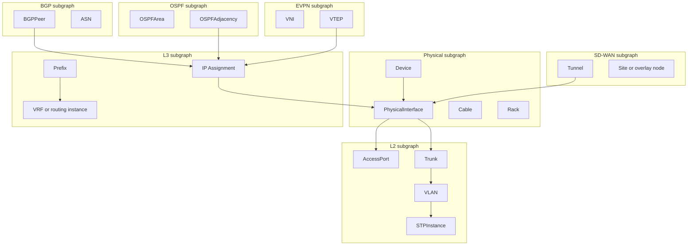

# NetCortex network graph topology — architecture plan

This document defines how NetCortex will model multi-layer network topology in a dedicated **graph store** (Neo4j first, other backends later). NetBox remains the **source of truth (SoT)** for inventory and declarative configuration; the graph is a **derived, specialized index** for path finding, protocol topology, and cross-layer reasoning—not a replacement for NetBox persistence.

---

## Goals

- Represent **physical**, **L2**, **L3**, **BGP**, **OSPF**, **EVPN**, **SD-WAN**, and optionally **MPLS/SR** as coherent, labeled subgraphs.
- Provide **stable identity** and **cross-layer anchors** so every graph entity can be tied back to NetBox IDs (and platform correlation keys such as `nc_platform_id`).
- Support **rebuild from NetBox + live adapters** with clear idempotency and recovery behavior.
- Expose topology via **MCP tools** (high-level queries + optional raw Cypher for power users).
- Use a **pluggable `GraphBackend`** with **Neo4j** for production and **NetworkX** for tests.

---

## Conceptual layering

Each protocol or media layer is modeled as a **logical subgraph**: nodes and relationships carry a `layer` property (and/or Neo4j labels) so queries can scope to one layer while **anchor relationships** link logical entities to physical ports, devices, or IPs.



---

## Graph data model

### Identity and correlation

| Concept | Strategy |
|--------|----------|
| **Primary SoT** | NetBox object IDs (integer PK) where applicable |
| **Stable platform key** | `nc_platform_id` on normalized devices (existing NetCortex convention) |
| **Graph node ID** | Prefer deterministic string: `{layer}:{netbox_type}:{netbox_id}` or `{layer}:{kind}:{stable_key}` |
| **Deduplication** | Upserts keyed by graph node ID; relationships keyed by `(start_id, type, end_id, discriminator_props)` |

Example node IDs:

- `physical:dcim.device:1234`
- `l2:ipam.vlan:89`
- `bgp:session:device-1234-peer-10.0.0.1-vrf-default`

### Node types by layer

#### 1. Physical

| Label / kind | Properties (non-exhaustive) | NetBox mapping |
|--------------|-----------------------------|----------------|
| `Device` | `name`, `role`, `site`, `netbox_id`, `nc_platform_id`, `status` | `dcim.Device` |
| `PhysicalInterface` | `name`, `type`, `enabled`, `mtu`, `device_netbox_id`, `netbox_id` | `dcim.Interface` |
| `Cable` | `netbox_id`, `status`, `length`, `color` | `dcim.Cable` |
| `FrontPort` / `RearPort` | `netbox_id`, `name`, `panel_device_id` | `dcim.FrontPort`, `dcim.RearPort` |
| `Rack` | `netbox_id`, `name`, `site` | `dcim.Rack` |

#### 2. L2

| Label / kind | Properties | Sources |
|--------------|------------|---------|
| `VLAN` | `vid`, `name`, `site`, `netbox_id` | NetBox `ipam.VLAN` |
| `AccessPort` | membership in VLAN, voice/data flags | NetBox interfaces + VLAN assignment |
| `Trunk` | allowed VLAN list (summary or encoded) | NetBox tagged VLANs |
| `STPInstance` | `vlan_vid` or `mst_instance`, `bridge_priority` (if known) | Platform adapter (STP state), optional NetBox custom fields |

#### 3. L3

| Label / kind | Properties | Sources |
|--------------|------------|---------|
| `VRF` | `name`, `rd`, `netbox_id` | NetBox `ipam.VRF` |
| `Prefix` | `prefix`, `role`, `netbox_id` | NetBox `ipam.Prefix` |
| `IPAddress` | `address`, `assigned_object_id`, `vrf_netbox_id` | NetBox `ipam.IPAddress` |

#### 4. BGP

| Label / kind | Properties | Sources |
|--------------|------------|---------|
| `ASN` | `asn`, `name`, `netbox_id` (if in NetBox) | NetBox `ipam.ASN` + live |
| `BGPPeer` | `local_asn`, `peer_asn`, `local_addr`, `peer_addr`, `afi_safi`, `state`, `uptime`, `rr_client`, `communities_in/out summary` | Adapters (BGP session table / API) |
| `RouteReflectorCluster` | `cluster_id`, member peer IDs | Derived from BGP topology |

#### 5. OSPF

| Label / kind | Properties | Sources |
|--------------|------------|---------|
| `OSPFInstance` | `router_id`, `process_id`, `vrf` | Adapter |
| `OSPFArea` | `area_id`, `stub_type` | Adapter |
| `OSPFAdjacency` | `state`, `dead_timer`, `priority` | Adapter |
| `LSASummary` | counts / last SPF (aggregated, not full LSDB) | Adapter summaries |

#### 6. EVPN

| Label / kind | Properties | Sources |
|--------------|------------|---------|
| `VNI` | `vni`, `type` (L2/L3), `rd/rt` hints | Adapter + NetBox overlays if modeled |
| `VTEP` | `vtep_ip`, `device_id` | Adapter |
| `EVPNESI` | `esi` | Adapter |

#### 7. SD-WAN

| Label / kind | Properties | Sources |
|--------------|------------|---------|
| `SDWANSite` / `OverlayNode` | site ID, role (hub/spoke), provider metadata | Adapter + NetBox site/device |
| `SDWANTunnel` | encapsulation (`ipsec`, `gre`, …), `state`, `sla_class` | Adapter |
| `ApplicationRoute` | app name, DSCP/path preference | Adapter policy |
| `UnderlayAnchor` | tie-back interface or circuit IDs | NetBox interfaces / circuits |

#### 8. MPLS / Segment routing (optional / future)

| Label / kind | Properties | Sources |
|--------------|------------|---------|
| `Label` / `SID` | label value, node/prefix adj SID | Adapter |
| `LSP` | path, protection | Adapter / controller |

### Relationship types by layer

**Physical**

- `(:Device)-[:HAS_INTERFACE]->(:PhysicalInterface)`
- `(:PhysicalInterface)-[:CONNECTED_TO {via: "cable|patch"}]->(:PhysicalInterface)`
- `(:Device)-[:IN_RACK]->(:Rack)`

**L2**

- `(:AccessPort)-[:MEMBER_OF {mode: "access"}]->(:VLAN)`
- `(:Trunk)-[:ALLOWS_VLAN]->(:VLAN)`
- `(:PhysicalInterface)-[:IMPLEMENTS]->(:AccessPort|Trunk)`
- `(:STPInstance)-[:SPANS_VLAN]->(:VLAN)`
- `(:STPInstance)-[:ROOT_PORT|BLOCKED|DESIGNATED {role}]->(:PhysicalInterface)` (from live STP)

**L3**

- `(:IPAddress)-[:ASSIGNED_TO]->(:PhysicalInterface|VirtualInterface)`
- `(:Prefix)-[:IN_VRF]->(:VRF)`
- `(:IPAddress)-[:WITHIN]->(:Prefix)`

**BGP**

- `(:BGPPeer)-[:LOCAL_ADDRESS]->(:IPAddress)`
- `(:BGPPeer)-[:PEER_ADDRESS]->(:IPAddress)`
- `(:BGPPeer)-[:USES_ASN {role: "local|peer"}]->(:ASN)`
- `(:BGPPeer)-[:BGP_SESSION_WITH]->(:BGPPeer)` (logical; often collapsed to one directed edge per device pair + AF)

**OSPF**

- `(:OSPFInstance)-[:ON_DEVICE]->(:Device)`
- `(:OSPFInstance)-[:HAS_AREA]->(:OSPFArea)`
- `(:OSPFAdjacency)-[:BETWEEN {network_type}]->(:OSPFRouterId)` or interface-backed nodes
- `(:OSPFAdjacency)-[:ADVERTISES_PREFIX_SUMMARY]->(:Prefix)` (optional derived)

**EVPN**

- `(:VNI)-[:TERMINATES_ON]->(:VTEP)`
- `(:VTEP)-[:USES_INTERFACE]->(:PhysicalInterface|Loopback)`
- `(:VNI)-[:MAPS_TO_VLAN {vlan_vid}]->(:VLAN)` (when known)

**SD-WAN**

- `(:SDWANTunnel)-[:ENDPOINT {local|remote}]->(:OverlayNode)`
- `(:SDWANTunnel)-[:ENCAPSULATES]->(:ApplicationRoute)` (policy-level, optional)
- `(:SDWANTunnel)-[:SD_WAN_TUNNEL_OVER_PHYSICAL]->(:PhysicalInterface)` **(cross-layer anchor)**

**MPLS/SR (future)**

- `(:LSP)-[:HOPS]->(:Interface|Node)`
- `(:Prefix)-[:RESOLVED_VIA_LABEL]->(:Label)`

### Cross-layer relationship types (anchors)

| Relationship | Meaning |
|--------------|---------|
| `ANCHORS_PHYSICAL_DEVICE` | Logical node (e.g. BGP peer endpoint) → `Device` |
| `BGP_PEER_USES_INTERFACE` | Session uses specific local interface / source IP |
| `OSPF_ADJ_USES_INTERFACE` | Adjacency on interface |
| `EVPN_VTEP_ON_INTERFACE` | VTEP IP bound to interface |
| `SD_WAN_TUNNEL_OVER_PHYSICAL` | Tunnel uses underlay interface(s) / circuit |
| `SD_WAN_SITE_DEVICE` | Overlay site mapped to NetBox device/site |

These anchors make shortest-path queries able to **start in overlay**, **traverse to underlay**, and **land on physical cables** when required.

### Example Cypher patterns

```cypher
// Physical device and interface (labels include layer for filtering)
CREATE (d:Device:LayerPhysical {
  graph_id: 'physical:dcim.device:1234',
  netbox_id: 1234,
  name: 'switch-01',
  nc_platform_id: 'meraki:network:xxx:serial:yyy'
})
CREATE (i:PhysicalInterface:LayerPhysical {
  graph_id: 'physical:dcim.interface:99901',
  netbox_id: 99901,
  name: 'Gi1/0/1',
  device_netbox_id: 1234
})
CREATE (d)-[:HAS_INTERFACE]->(i);
```

```cypher
// BGP peer anchored to local interface / IP
CREATE (p:BGPPeer:LayerBGP {
  graph_id: 'bgp:session:1234-10.1.1.1-default',
  state: 'Established',
  peer_asn: 65001
})
CREATE (ip:IPAddress:LayerL3 {
  graph_id: 'l3:ipam.ipaddress:500',
  address: '10.1.1.2/30'
})
CREATE (p)-[:LOCAL_ADDRESS]->(ip)
CREATE (p)-[:BGP_PEER_USES_INTERFACE]->(i:PhysicalInterface:LayerPhysical { graph_id: 'physical:dcim.interface:99901' });
```

```cypher
// SD-WAN tunnel over physical underlay
CREATE (t:SDWANTunnel:LayerSDWAN {
  graph_id: 'sdwan:tunnel:edge-A-edge-B-1',
  encapsulation: 'ipsec',
  operational_state: 'up'
})
CREATE (t)-[:SD_WAN_TUNNEL_OVER_PHYSICAL]->(i);
```

---

## Backend abstraction

### `GraphBackend` (abstract base class)

Placed under something like `netcortex.graph.backend.base`. Methods:

| Method | Purpose |
|--------|---------|
| `upsert_node(layer: str, kind: str, id: str, properties: dict) -> None` | Idempotent node merge |
| `upsert_edge(layer: str, rel_type: str, source_id: str, target_id: str, properties: dict) -> None` | Idempotent edge merge |
| `delete_node(graph_id: str, cascade: bool = False) -> None` | Remove node (and optional edges) |
| `query_neighbors(graph_id: str, layer: str \| None, rel_types: list[str] \| None, depth: int) -> ...` | Bounded neighborhood |
| `query_path(source_id: str, target_id: str, layer: str, constraints: dict \| None) -> ...` | Shortest-path (layer-scoped) |
| `query_layer(layer: str, filters: dict \| None) -> ...` | List nodes/edges in a layer |
| `wipe_layer(layer: str) -> None` | Delete all nodes (and incident edges) for that layer — used for full rebuild per layer |

Return types should be **Pydantic v2 models** (e.g. `GraphNode`, `GraphEdge`, `PathResult`) for consistency with the rest of NetCortex.

### `Neo4jBackend`

- Uses official **async** Neo4j driver (aligned with Python 3.12+ async stack).
- Maps `upsert_node` / `upsert_edge` to `MERGE` with `ON MATCH SET` / `ON CREATE SET`.
- Implements `query_path` with `shortestPath` or `apoc.path.spanningTree` if APOC is enabled (optional dependency in deployment).
- **Indexes/constraints**: unique constraint on `graph_id`; composite indexes on `(layer, kind)` and `netbox_id` for correlation.

### `NetworkXBackend`

- In-memory `networkx.MultiDiGraph` per layer or one graph with `layer` edge/node attributes.
- Same method signatures; used in **unit tests** and offline fixtures without Neo4j.
- Path APIs use `nx.shortest_path` with weight keys.

### Registration via `pyproject.toml`

Mirror adapter entry point groups, e.g.:

```toml
[project.entry-points."netcortex.graph_backends"]
neo4j = "netcortex.graph.backends.neo4j:Neo4jBackend"
networkx = "netcortex.graph.backends.networkx:NetworkXBackend"
```

Factory/registry loads by config (e.g. NetBox Secrets–backed setting `GRAPHS_BACKEND=neo4j`), consistent with adapter discovery patterns.

---

## NetBox as source of truth

### From NetBox (declarative inventory)

- **Devices**, **sites**, **racks**, **roles**, **platforms**.
- **Interfaces** (physical + virtual), **cables**, **patch panels**, **front/rear ports**.
- **VLANs**, **VRFs**, **prefixes**, **IP addresses**, **ASN objects** (if populated).
- **Circuits** (for SD-WAN / WAN underlay correlation when present).

### From live platform adapters (operational state)

- **BGP**: session state, AFIs, prefixes summary (optional), large communities, RR role.
- **OSPF**: areas, adjacencies, SPF-related timers; **LSA detail** stays summarized unless explicitly scoped.
- **STP**: per-VLAN roles, root bridge, blocking ports.
- **EVPN**: VTEPs, VNIs, BGP EVPN routes (control plane hints).
- **SD-WAN**: tunnel status, path selection, SLA metrics, application routes.
- **MPLS/SR** (future): label stack, SIDs, LSP state.

### Reconciliation strategy

1. **Full rebuild**: For each layer `L`, `wipe_layer(L)`, then run `build_*_layer()` from fresh NetBox + adapter snapshots.
2. **Incremental** (later phase): subscribe to sync engine events (device/interface/VLAN/IP changed) and patch affected subgraphs; protocol layers refresh on shorter TTL polls or event triggers.
3. **Authoritative merge rules**: NetBox wins for **inventory shape** (what exists, names, IDs); adapters win for **session/tunnel operational state** and **time-varying protocol topology**; stale adapter data is overwritten on each successful poll or removed if entity absent.

---

## Graph builder

### `GraphBuilder`

Orchestrates population order (respects anchors):

1. `build_physical_layer()` — devices, interfaces, cables, racks.
2. `build_l2_layer()` — VLANs, access/trunk mapping, STP if available.
3. `build_l3_layer()` — VRFs, prefixes, IPs, links to interfaces.
4. `build_bgp_layer()` — ASNs, peers, sessions, RR structure.
5. `build_ospf_layer()` — instances, areas, adjacencies.
6. `build_evpn_layer()` — VNIs, VTEPs, bindings.
7. `build_sdwan_layer()` — sites, tunnels, app routes, underlay anchors.
8. `build_mpls_sr_layer()` — optional stub / future.

Each `build_*` writes only its **layer labels** plus **cross-layer edges** to already-written lower layers (builder runs in order above).

### Incremental vs full rebuild

| Mode | When | Behavior |
|------|------|----------|
| **Full** | Nightly, after major NetBox import, or manual `POST /graph/rebuild` | `wipe_layer` per protocol layer; physical+L3 from NetBox; protocols from adapters |
| **Incremental** | NetBox webhook / internal sync event | Patch nodes/edges by `graph_id`; re-query small neighborhood |
| **Protocol refresh** | Schedule (e.g. 5–15 min) | Re-run adapter fetch for BGP/OSPF/SD-WAN only; upsert replaces old state |

### Triggers

- **Sync engine** events (existing worker/Celery path): enqueue `graph.patch_device(device_id)`.
- **Manual API**: operator-triggered rebuild or layer-scoped refresh.
- **Scheduled job**: Celery beat or worker ticker for protocol layers.

---

## MCP tools (graph queries)

Thin MCP layer: tools delegate to `GraphService` / backend — **no business logic in tool files** (per project rules).

| Tool | Description |
|------|-------------|
| `find_path(src_device, dst_device, layer)` | Shortest path in subgraph constrained to `layer` (and optional anchor hops). |
| `list_neighbors(device, layer)` | Bounded neighbor list with relationship types. |
| `get_protocol_peers(device, protocol)` | `protocol` ∈ `bgp`, `ospf`, `evpn`, `sdwan`, … — returns peer nodes + key props. |
| `get_cross_layer_anchors(node_id)` | All layers and anchor edges for a `graph_id`. |
| `query_graph(cypher_query)` | **Neo4j only**: restricted passthrough for power users (read-only role, query allowlist or prefix guard in production). |

Responses return structured JSON matching Pydantic schemas for agent consumption.

---

## Rebuild / recovery

### Full rebuild from NetBox + live polling

1. Acquire **read-only NetBox snapshot** (paginated fetch of relevant objects).
2. For each enabled adapter, pull **current protocol/overlay state** (timeouts logged with `structlog`).
3. Run `GraphBuilder` full sequence with transactional batches per layer (Neo4j: `WRITE` transactions scoped per layer where possible).
4. Record **build manifest**: timestamp, NetBox revision (if available), adapter versions.

### Idempotency

- **Upserts** keyed by deterministic `graph_id` ensure repeat runs converge to the same graph state.
- **Deletes**: only via explicit `wipe_layer` or `delete_node` when NetBox removes an object (sync handler emits tombstone event).

### NetBox vs graph drift

- **Detection**: compare NetBox object counts / checksums vs graph layer stats; optional periodic full rebuild.
- **Remediation**: operator runs **full rebuild**; logs flag layers with partial adapter failure (graph may be best-effort for that layer until retry succeeds).
- **Read path**: MCP tools document `last_built_at` / `partial_data` flags in responses when a layer failed last refresh.

---

## Docker / deployment additions

### Optional Neo4j service (Compose **profile**)

Neo4j should not be required for minimal NetCortex bring-up. Add a **`graph` profile** in `docker-compose.yml`:

```yaml
services:
  neo4j:
    image: neo4j:5-community
    profiles: ["graph"]
    environment:
      NEO4J_AUTH: ${NEO4J_USER:-neo4j}/${NEO4J_PASSWORD:?set NEO4J_PASSWORD}
      NEO4J_server_memory_heap_initial__size: 512M
      NEO4J_server_memory_heap_max__size: 1G
    ports:
      - "7474:7474"
      - "7687:7687"
    volumes:
      - neo4j_data:/data
    healthcheck:
      test: ["CMD", "cypher-shell", "-u", "neo4j", "-p", "${NEO4J_PASSWORD}", "RETURN 1"]
      interval: 15s
      timeout: 5s
      retries: 5
      start_period: 60s

volumes:
  neo4j_data:
```

NetCortex `depends_on` Neo4j only when `GRAPHS_ENABLED=true` (or similar) — avoid coupling the default stack.

### Environment variables (stored in NetBox Secrets in production)

| Variable | Purpose |
|----------|---------|
| `GRAPHS_ENABLED` | Master toggle for graph builder + MCP tools |
| `GRAPHS_BACKEND` | `neo4j` \| `networkx` |
| `NEO4J_URI` | e.g. `bolt://neo4j:7687` |
| `NEO4J_USER` / `NEO4J_PASSWORD` | Credentials |
| `GRAPHS_CYPHER_READONLY` | Enforce read-only Neo4j user for `query_graph` |

### Health / status page integration

- Extend **`/health`** (or **`/health/detail`**) to report `graph: { ok, backend, last_full_build_at, layers_degraded[] }` when graphs are enabled.
- **Docker HEALTHCHECK** remains HTTP-based on `/health` (already uses Python stdlib probe in container image).
- Compose: optional `netcortex` dependency `neo4j: condition: service_healthy` only under profile `graph`.

---

## Implementation phasing

1. **Phase 0**: `GraphBackend` + `NetworkXBackend` + tests; MCP stubs.
2. **Phase 1**: `Neo4jBackend`, physical + L3 layers from NetBox only.
3. **Phase 2**: L2 + BGP from adapters (pilot: one platform).
4. **Phase 3**: OSPF + EVPN + SD-WAN layers and cross-layer anchors.
5. **Phase 4**: Incremental updates + hardened `query_graph` policy; MPLS/SR optional layer.

---

## Summary

This plan keeps **NetBox authoritative for inventory** while using a **dedicated graph** for multi-layer topology queries. Layers are **explicit subgraphs** in Neo4j (labels + `layer` properties), with **cross-layer anchor relationships** back to physical interfaces and devices. **Backends are pluggable** via entry points; **GraphBuilder** coordinates layered rebuilds; **MCP tools** expose safe, task-oriented queries with optional Cypher for experts; **Docker** gains an optional **Neo4j profile** and health/status integration without blocking the default Compose stack.
